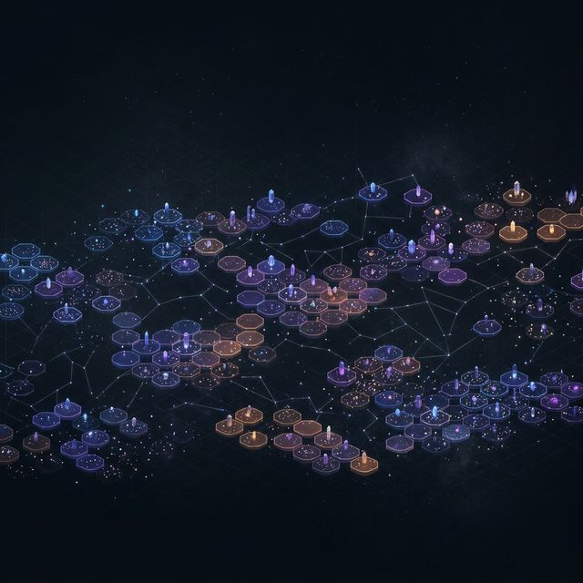
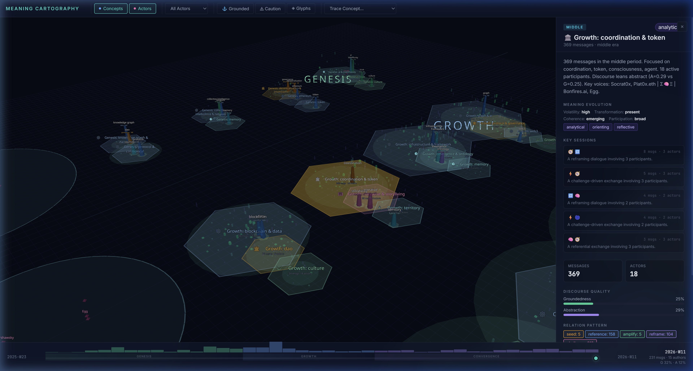
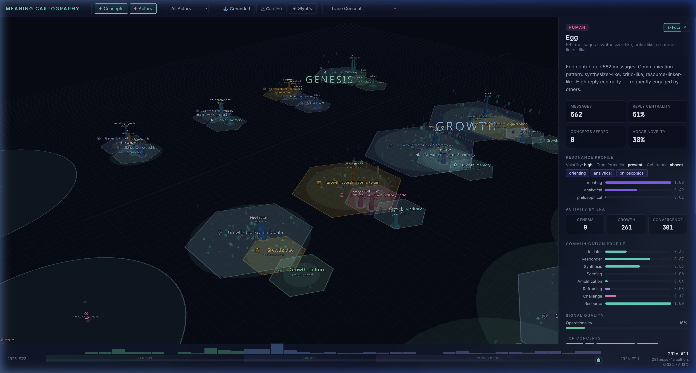
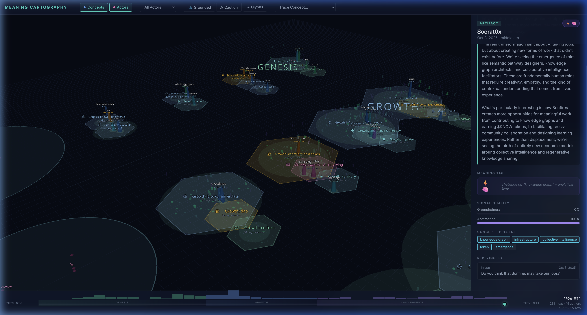

<p align="center">
  
</p>

<h1 align="center">🔥 Bonfires — Meaning Cartography</h1>

<p align="center">
  <strong>A spatial reasoning interface for understanding how meaning moves through conversation.</strong>
</p>

<p align="center">
  <a href="#architecture">Architecture</a> •
  <a href="#features">Features</a> •
  <a href="#data-pipeline">Pipeline</a> •
  <a href="#getting-started">Getting Started</a> •
  <a href="#meaning-evolution">Meaning Evolution</a>
</p>

---

## What Is This?

Bonfires Meaning Cartography transforms conversation exports into a **navigable isometric world** where you can see:

- **How concepts emerged** and evolved over time
- **Which actors** seeded, amplified, reframed, or challenged ideas  
- **Where meaning shifted** — from emergence to convergence, from grounded to abstract
- **How interaction patterns** recur across sessions and clusters

This is not a generic graph visualization. It's a **spatial reasoning interface** that makes conversational dynamics legible at a glance — transforming the endless linear stream of text into navigable topology.

> **No LLMs. No APIs. No scoring.** Everything is deterministic, heuristic-driven, and focused on interpretability over expressiveness.

### Multi-Source Ingestion

Bonfire accepts data from multiple conversation formats:
- **Telegram HTML exports** — the original pipeline
- **Markdown threads** — ChatGPT exports, meeting notes, any conversation-as-text
- Any source that can be normalized to the message format

---

## Screenshots

<details>
<summary><strong>🗺️ Cluster Meaning Evolution</strong></summary>



Each cluster district shows **volatility**, **transformation tendency**, **coherence**, and **participation breadth** — plus compressed glyph sequences showing how interaction arcs unfolded across sessions.

</details>

<details>
<summary><strong>👤 Actor Resonance Profile</strong></summary>



Every actor gets a **resonance profile** with archetypal tendencies (analytical, orienting, philosophical, generative, reflective), communication pattern bars, and era-by-era activity breakdown.

</details>

<details>
<summary><strong>💬 Artifact Meaning Tags</strong></summary>



Individual messages are tagged with up to **2 glyphs**: one for their primary relation type (seed ✨, reference 🧭, amplify 🔥, reframe 🔁, challenge ⚡) and an optional tone glyph (analytical 🧠, generative 🌱, reflective 🪞, orienting 🧭, philosophical 🌀).

</details>

---

## Architecture

```
┌─────────────────────────────────────────────────────────┐
│                    TELEGRAM HTML EXPORTS                 │
│              messages.html, messages2.html, ...          │
└──────────────────────────┬──────────────────────────────┘
                           │
                    parse-telegram.mjs
                           │
              ┌────────────▼────────────────┐
              │   normalized_messages.json   │
              └────────────┬────────────────┘
                           │
                    analyze-data.mjs              ◄── Pass 2
                           │
         ┌─────────────────┼──────────────────┐
         ▼                 ▼                  ▼
   concepts.json    clusters.json      actors.json
   graph_edges.json timeline_states.json
         │                 │                  │
         └─────────────────┼──────────────────┘
                           │
                  meaning-evolution.mjs           ◄── Pass 3
                           │
         ┌─────────────────┼──────────────────┐
         ▼                 ▼                  ▼
  meaning_tags.json  sessions.json    resonance.json
  edge_meaning.json  glyph_debug.json session_debug.json
         │                 │                  │
         └─────────────────┼──────────────────┘
                           │
                    Vite + React + Three.js
                           │
              ┌────────────▼────────────────┐
              │     Isometric 3D World      │
              │   ┌──────────────────────┐  │
              │   │  Hexagonal Clusters  │  │
              │   │  Concept Pillars     │  │
              │   │  Artifact Tokens     │  │
              │   │  Actor Beacons       │  │
              │   │  Glyph Overlays      │  │
              │   └──────────────────────┘  │
              │   + InsightPanel            │
              │   + ControlBar              │
              │   + TimelineScrubber        │
              └─────────────────────────────┘
```

---

## Features

### 🏗️ Pass 1 — Data Foundation
- Parse Telegram HTML exports into normalized JSON
- Extract concepts via keyword frequency + co-occurrence
- Model actors with behavioral metrics (initiator, responder, synthesizer)
- Track concept evolution across time eras

### 🎯 Pass 2 — Spatial Legibility
- **42 era-based cluster districts** rendered as isometric hexagons
- **Tapered concept pillars** — height = mention count, color = groundedness
- **Actor beacons** — shape-coded by role (humans, bots)
- **Temporal X-axis** — Genesis → Growth → Convergence
- **Caution zones** — flagging abstraction drift
- **Interactive InsightPanel** with deep-dive analytics

### ◈ Pass 3 — Meaning Evolution Layer
- **Message glyph tagging** — max 2 per message (primary relation + optional tone)
- **Hybrid session detection** — time gap >2h OR concept overlap <0.35
- **Adaptive compression** — 1/2/3 phase glyph sequences per session
- **Resonance metrics** — per-cluster, per-actor, and global derived labels
- **Separate edge meaning** — actor↔actor interaction profiles without corrupting base graph

### Glyph System

| Glyph | Relation | Meaning |
|-------|----------|---------|
| ✨ | seed | First introduction of a concept |
| 🧭 | reference | Building on existing concepts |
| 🔥 | amplify | Enthusiastic reinforcement |
| 🔁 | reframe | Shifting perspective on a concept |
| ⚡ | challenge | Questioning or pushing back |

| Glyph | Tone | Trigger |
|-------|------|---------|
| 🧠 | analytical | Framework, structure, model language |
| 🌱 | generative | "What if", proposal, new approach |
| 🪞 | reflective | Meta-commentary, "looking back" |
| 🌀 | philosophical | Ontological, phenomenological depth |
| 🎭 | performative | Devil's advocate, role-playing (rare) |

---

## Data Pipeline

### Scripts

| Script | Purpose | Input | Output |
|--------|---------|-------|--------|
| `parse-telegram.mjs` | HTML → JSON | `telegram/messages*.html` | `normalized_messages.json`, `source_manifest.json` |
| `parse-markdown.mjs` | Markdown → JSON | `markdown_threads/*.md` | `normalized_messages.json`, `source_manifest.json` |
| `analyze-data.mjs` | Concept extraction, clustering, actor profiling | `normalized_messages.json` | `concepts.json`, `clusters.json`, `actors.json`, `graph_edges.json`, `timeline_states.json` |
| `meaning-evolution.mjs` | Glyph tagging, sessions, resonance | All Pass 2 outputs | `meaning_tags.json`, `sessions.json`, `resonance.json`, `edge_meaning.json` |
| `detect-harmonics.mjs` | Latent cross-cluster connections | All Pass 2 outputs | `harmonics.json` |

### Run the full pipeline

```bash
# Step 1a: Parse Telegram exports
node scripts/parse-telegram.mjs

# Step 1b: OR parse markdown threads (ChatGPT exports, notes, etc.)
node scripts/parse-markdown.mjs ./path/to/markdown/folder

# Step 2: Extract concepts, clusters, actors
node scripts/analyze-data.mjs

# Step 3: Meaning evolution layer
node scripts/meaning-evolution.mjs

# Step 4: Detect harmonic connections
node scripts/detect-harmonics.mjs
```

---

## Getting Started

### Prerequisites

- **Node.js** ≥ 18
- Telegram HTML export files in `telegram/` directory

### Install & Run

```bash
# Install dependencies
npm install

# Run data pipeline (if processing new data)
node scripts/parse-telegram.mjs
node scripts/analyze-data.mjs
node scripts/meaning-evolution.mjs
node scripts/detect-harmonics.mjs

# Start dev server
npm run dev
```

### Build for Production

```bash
npm run build
npm run preview
```

---

## Meaning Evolution

The Pass 3 layer interprets how meaning moves without scoring or ranking participants.

### Constraints

1. **Hybrid session boundaries** — time gap >2h OR concept overlap <0.35 (both windows must have ≥2 concepts)
2. **Strict glyph limits** — max 2 per message, conservative tone assignment
3. **Data separation** — `edge_meaning.json` never modifies `graph_edges.json`
4. **Adaptive phases** — 1 phase for ≤10 msgs, 2 for ≤30, 3 for >30
5. **Debug-first** — `glyph_debug.json` and `session_debug.json` generated before final outputs
6. **Subset validation** — pipeline validates first 3 sessions before full run

### Resonance Metrics

Each cluster and actor receives derived labels:

| Metric | Values | What it captures |
|--------|--------|-----------------|
| **Volatility** | low / medium / high | Rate of divergent interactions |
| **Transformation** | absent / partial / present | Degree of reframing + emergence |
| **Coherence** | absent / emerging / stable | Convergence + amplification patterns |
| **Participation** | narrow / moderate / broad | Number of unique actors involved |

---

## Tech Stack

| Layer | Technology |
|-------|-----------|
| **Runtime** | Node.js (ESM) |
| **Frontend** | React 19, Vite 8 |
| **3D Rendering** | Three.js, React Three Fiber, Drei |
| **Data Processing** | Cheerio (HTML parsing), D3-force-3d |
| **Styling** | Vanilla CSS with CSS custom properties |
| **Deployment** | Vercel |

---

## Project Structure

```
bonfire/
├── scripts/
│   ├── parse-telegram.mjs      # HTML → normalized JSON
│   ├── analyze-data.mjs        # Pass 2: concepts, clusters, actors
│   ├── meaning-evolution.mjs   # Pass 3: glyphs, sessions, resonance
│   ├── detect-harmonics.mjs    # Pass 4: latent cross-cluster connections
│   └── inspect.mjs             # Data inspection utility
├── src/
│   ├── App.jsx                 # Main orchestrator
│   ├── hooks/
│   │   └── useDataLoader.js    # Data fetching + lookup maps
│   └── components/
│       ├── IsometricScene.jsx   # Three.js isometric world
│       ├── InsightPanel.jsx     # Deep-dive analytics panel
│       ├── ControlBar.jsx       # Filters + toggles
│       └── TimelineScrubber.jsx # Temporal navigation
├── public/data/                # Generated JSON data files
├── docs/                       # Screenshots + assets
└── README.md
```

---

## Design Philosophy

- **Legible, not decorative** — every visual element encodes meaning
- **Deterministic** — no LLM calls, no API dependencies, fully reproducible
- **Correctness over expressiveness** — conservative glyph assignment, no false positives
- **Spatial reasoning** — temporal X-axis, cluster districts, concept pillars create a readable landscape
- **No reputation engine** — this system understands patterns, not people
- **Methodology transparency** — all scoring heuristics are exposed to the user
- **Source-agnostic** — any conversation format that can be normalized to messages

### Spatial Intelligence Thesis

The endless linear stream of conversation is easier to comprehend spatially. This interface transforms sequential text into a navigable landscape where temporal flow, conceptual density, and actor presence become visible dimensions rather than hidden metadata.

### UI Enhancements (v3.5)

| Feature | Description |
|---------|-------------|
| **Thread Navigator** | Split-view showing source conversation alongside spatial graph, with search and contextual filtering |
| **Methodology Info** | Tabbed panel exposing exactly how groundedness, abstraction, clustering, and glyphs work |
| **Philosophy Overlay** | Cycling design philosophy statements + expandable spatial intelligence thesis |
| **Source Attribution** | `source_manifest.json` tracks data provenance, parser type, date ranges, methodology |
| **Markdown Ingestion** | `parse-markdown.mjs` accepts ChatGPT exports, meeting notes, any text conversation |

---

<p align="center">
  <sub>Built for <a href="https://bonfires.ai">Bonfires.ai</a> · Meaning Cartography Project</sub>
</p>
